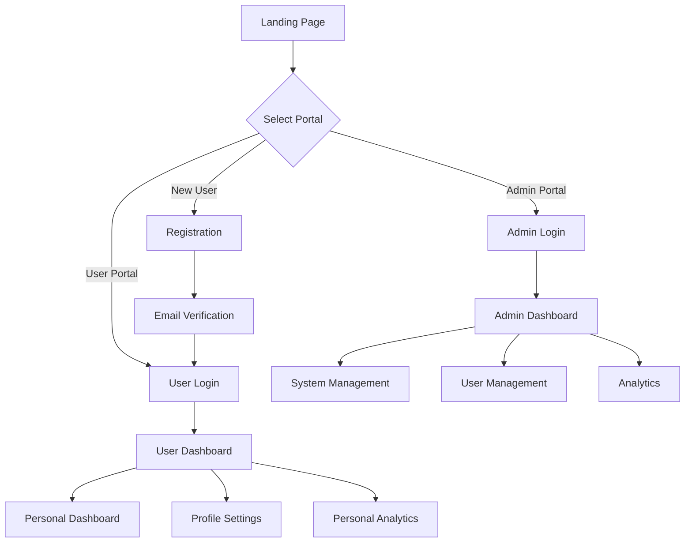

## 1. Product Overview
A comprehensive dual-dashboard system that provides distinct interfaces for administrators and regular users with role-based access control. The system ensures secure segregation of functionality while maintaining consistent branding across both interfaces.

**Problems Solved:**
- Prevents unauthorized access to sensitive admin functions
- Provides personalized user experiences based on role
- Maintains clear visual distinction between user types
- Offers comprehensive analytics and management tools for administrators

**Target Users:**
- System administrators requiring full control and analytics
- Regular users needing personalized dashboard with basic functionality

## 2. Core Features

### 2.1 User Roles
| Role | Registration Method | Core Permissions |
|------|---------------------|------------------|
| Administrator | Admin-only registration via secure invite | Full system access, user management, analytics, system configuration |
| Regular User | Standard email registration | Personal dashboard access, basic profile management, limited feature access |

### 2.2 Feature Module
Our dual-dashboard system consists of the following main interfaces:
1. **Admin Dashboard**: comprehensive management tools, system analytics, user management, configuration controls
2. **User Dashboard**: personalized content display, basic profile management, user-specific features
3. **Login/Registration**: role-based authentication, secure access control
4. **Landing Page**: public interface with clear role selection

### 2.3 Page Details
| Page Name | Module Name | Feature description |
|-----------|-------------|---------------------|
| Landing Page | Role Selection | Display clear visual distinction between Admin and User login options with different color schemes and access paths |
| Admin Dashboard | Analytics Overview | Display system-wide statistics, user activity metrics, performance indicators with real-time updates |
| Admin Dashboard | User Management | View, search, filter, edit, and manage all user accounts with bulk operations and role assignment |
| Admin Dashboard | System Configuration | Configure system settings, manage permissions, set access rules, and customize platform parameters |
| Admin Dashboard | Content Management | Create, edit, delete, and moderate user-generated content with approval workflows |
| Admin Dashboard | Security Monitoring | Monitor login attempts, security alerts, audit logs, and suspicious activity tracking |
| User Dashboard | Personal Overview | Display personalized welcome message, recent activity, and user-specific quick stats |
| User Dashboard | Profile Management | Edit personal information, change password, update preferences, and manage notification settings |
| User Dashboard | Personal Analytics | Show individual usage statistics, activity history, and personal progress metrics |
| User Dashboard | Quick Actions | Access frequently used features with customizable shortcuts and quick-access buttons |
| Login Page | Authentication | Secure login with role detection, password recovery, and multi-factor authentication support |
| Registration Page | User Registration | Standard user registration with email verification and basic profile setup |

## 3. Core Process

### Admin User Flow
1. Admin accesses landing page and selects "Admin Portal"
2. Redirected to admin-specific login page with dark theme
3. Authenticates with admin credentials and 2FA if enabled
4. Lands on comprehensive admin dashboard with full navigation
5. Can access all management tools, analytics, and system controls
6. Session automatically expires after extended inactivity

### Regular User Flow
1. User accesses landing page and selects "User Portal"
2. Redirected to user-friendly login page with light theme
3. Authenticates with standard credentials
4. Lands on personalized dashboard with limited navigation
5. Can only access personal features and basic functionality
6. Session management with standard security protocols

### Registration Flow
1. New users access public registration page
2. Complete standard registration form with email verification
3. Automatically assigned "Regular User" role
4. Cannot self-register as admin (admin accounts require invitation)
5. Email confirmation required before dashboard access

## 4. User Interface Design

### 4.1 Design Style
**Admin Dashboard Theme:**
- Primary Color: #1a1a1a (Dark charcoal) with #2d3748 (Slate gray) accents
- Secondary Color: #e53e3e (Red accent) for alerts and important actions
- Button Style: Sharp corners, minimalist design, hover effects with color transitions
- Font: Inter or Roboto, 14-16px for body text, 18-24px for headers
- Layout: Sidebar navigation with main content area, data-heavy tables and charts
- Icons: Material Design icons with consistent sizing and color coding

**User Dashboard Theme:**
- Primary Color: #ffffff (White) with #f7fafc (Light gray) backgrounds
- Secondary Color: #3182ce (Blue) for primary actions and links
- Button Style: Rounded corners, friendly design, subtle shadow effects
- Font: Open Sans or Lato, 16px for body text, 20-28px for headers
- Layout: Top navigation with card-based content organization
- Icons: Feather icons or Heroicons with softer visual style

**Common Branding Elements:**
- Logo placement: Top-left corner on all pages
- Consistent typography hierarchy across both dashboards
- Similar spacing and grid systems for familiarity
- Unified iconography for common actions (logout, settings, profile)

### 4.2 Page Design Overview
| Page Name | Module Name | UI Elements |
|-----------|-------------|-------------|
| Landing Page | Role Selection | Split-screen design with admin side in dark theme, user side in light theme, prominent role selection buttons with hover animations |
| Admin Dashboard | Analytics Overview | Dark-themed cards with white text, real-time charts using Chart.js, data tables with sorting/filtering, alert badges in red |
| Admin Dashboard | User Management | Full-width data table with pagination, search bar with filters, bulk action buttons, user status indicators with color coding |
| User Dashboard | Personal Overview | Light-themed welcome card with user avatar, activity timeline with soft colors, quick stats in rounded cards, friendly typography |
| User Dashboard | Profile Management | Form-based layout with input validation, save/cancel buttons with clear visual hierarchy, profile photo upload with preview |

### 4.3 Responsiveness
- **Desktop-first approach** with breakpoints at 1200px, 768px, and 480px
- Admin dashboard maintains sidebar navigation down to tablet size
- User dashboard switches from top navigation to hamburger menu on mobile
- Touch-optimized interactions for mobile devices
- Responsive tables with horizontal scrolling for smaller screens
- Card-based layouts that stack vertically on mobile devices