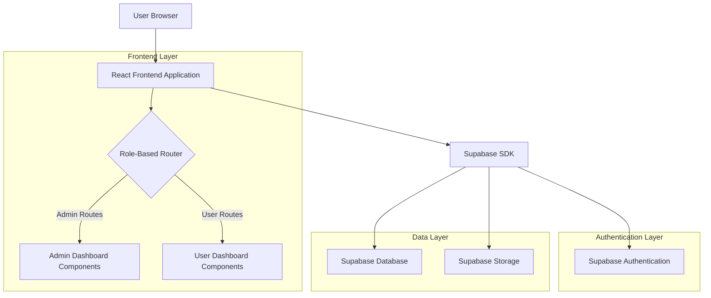
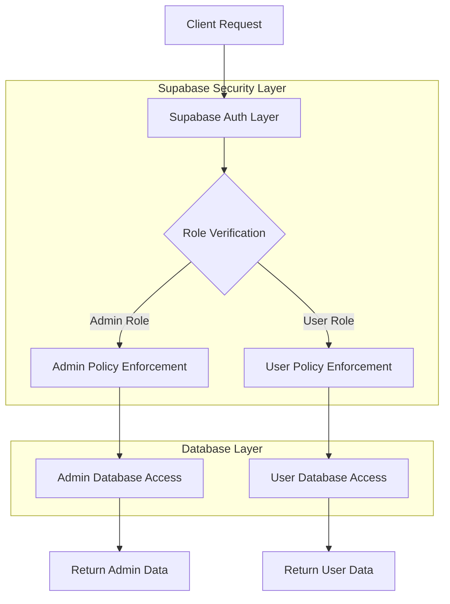
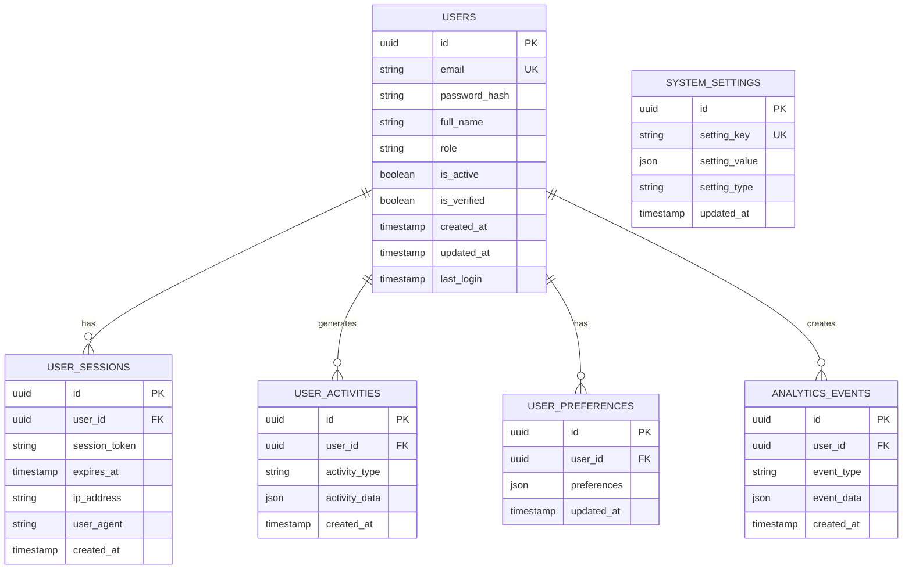

## 1. Architecture Design



## 2. Technology Description
- Frontend: React@18 + tailwindcss@3 + vite
- Initialization Tool: vite-init
- Backend: Supabase (Authentication, Database, Storage)
- State Management: React Context + useReducer
- Routing: React Router v6
- Charts/Analytics: Chart.js + react-chartjs-2
- Form Validation: React Hook Form + Zod
- UI Components: Headless UI + Heroicons

## 3. Route Definitions
| Route | Purpose | Access Level |
|-------|---------|--------------|
| / | Landing page with role selection | Public |
| /login/admin | Admin login page | Public (redirects if authenticated) |
| /login/user | User login page | Public (redirects if authenticated) |
| /register | User registration page | Public |
| /admin/dashboard | Main admin dashboard | Admin only |
| /admin/users | User management page | Admin only |
| /admin/analytics | System analytics page | Admin only |
| /admin/settings | System configuration page | Admin only |
| /user/dashboard | User dashboard homepage | User only |
| /user/profile | User profile management | User only |
| /user/analytics | Personal analytics page | User only |
| /user/settings | User preferences | User only |
| /unauthorized | Access denied page | Public |

## 4. API Definitions

### 4.1 Authentication APIs

**Admin Login**
```
POST /auth/v1/token?grant_type=password
```

Request:
```json
{
  "email": "admin@example.com",
  "password": "secure_password"
}
```

Response:
```json
{
  "access_token": "eyJhbGciOiJIUzI1NiIsInR5cCI6IkpXVCJ9...",
  "token_type": "bearer",
  "expires_in": 3600,
  "refresh_token": "-QDKUMyX3HfHjaLJdGAmqQ",
  "user": {
    "id": "admin_user_id",
    "email": "admin@example.com",
    "role": "admin"
  }
}
```

**User Registration**
```
POST /auth/v1/signup
```

Request:
```json
{
  "email": "user@example.com",
  "password": "user_password",
  "data": {
    "full_name": "John Doe",
    "role": "user"
  }
}
```

### 4.2 Database APIs

**Get All Users (Admin only)**
```
GET /rest/v1/users?select=*
```

Response:
```json
[
  {
    "id": "user_id_1",
    "email": "user1@example.com",
    "full_name": "John Doe",
    "role": "user",
    "created_at": "2024-01-01T00:00:00Z",
    "last_login": "2024-01-15T10:30:00Z",
    "is_active": true
  }
]
```

**Get User Analytics (Admin)**
```
GET /rest/v1/analytics?select=*&order=created_at.desc&limit=100
```

**Get Personal Dashboard Data (User)**
```
GET /rest/v1/user_data?id=eq.{userId}&select=*
```

## 5. Server Architecture Diagram



## 6. Data Model

### 6.1 Data Model Definition



### 6.2 Data Definition Language

**Users Table**
```sql
-- Create users table
CREATE TABLE users (
    id UUID PRIMARY KEY DEFAULT gen_random_uuid(),
    email VARCHAR(255) UNIQUE NOT NULL,
    password_hash VARCHAR(255) NOT NULL,
    full_name VARCHAR(255) NOT NULL,
    role VARCHAR(20) DEFAULT 'user' CHECK (role IN ('admin', 'user')),
    is_active BOOLEAN DEFAULT true,
    is_verified BOOLEAN DEFAULT false,
    created_at TIMESTAMP WITH TIME ZONE DEFAULT NOW(),
    updated_at TIMESTAMP WITH TIME ZONE DEFAULT NOW(),
    last_login TIMESTAMP WITH TIME ZONE
);

-- Create indexes
CREATE INDEX idx_users_email ON users(email);
CREATE INDEX idx_users_role ON users(role);
CREATE INDEX idx_users_created_at ON users(created_at DESC);

-- Row Level Security (RLS) policies
ALTER TABLE users ENABLE ROW LEVEL SECURITY;

-- Users can only see their own data
CREATE POLICY "Users can view own profile" ON users
    FOR SELECT USING (auth.uid() = id);

-- Admins can see all users
CREATE POLICY "Admins can view all users" ON users
    FOR SELECT USING (EXISTS (
        SELECT 1 FROM users 
        WHERE id = auth.uid() AND role = 'admin'
    ));

-- Users can update their own profile
CREATE POLICY "Users can update own profile" ON users
    FOR UPDATE USING (auth.uid() = id)
    WITH CHECK (auth.uid() = id);

-- Admins can update any user
CREATE POLICY "Admins can update any user" ON users
    FOR UPDATE USING (EXISTS (
        SELECT 1 FROM users 
        WHERE id = auth.uid() AND role = 'admin'
    ));
```

**User Activities Table**
```sql
-- Create user activities table
CREATE TABLE user_activities (
    id UUID PRIMARY KEY DEFAULT gen_random_uuid(),
    user_id UUID NOT NULL REFERENCES users(id) ON DELETE CASCADE,
    activity_type VARCHAR(50) NOT NULL,
    activity_data JSONB,
    created_at TIMESTAMP WITH TIME ZONE DEFAULT NOW()
);

-- Create indexes
CREATE INDEX idx_user_activities_user_id ON user_activities(user_id);
CREATE INDEX idx_user_activities_created_at ON user_activities(created_at DESC);
CREATE INDEX idx_user_activities_type ON user_activities(activity_type);

-- Row Level Security (RLS) policies
ALTER TABLE user_activities ENABLE ROW LEVEL SECURITY;

-- Users can see their own activities
CREATE POLICY "Users can view own activities" ON user_activities
    FOR SELECT USING (auth.uid() = user_id);

-- Admins can see all activities
CREATE POLICY "Admins can view all activities" ON user_activities
    FOR SELECT USING (EXISTS (
        SELECT 1 FROM users 
        WHERE id = auth.uid() AND role = 'admin'
    ));
```

**System Settings Table**
```sql
-- Create system settings table
CREATE TABLE system_settings (
    id UUID PRIMARY KEY DEFAULT gen_random_uuid(),
    setting_key VARCHAR(100) UNIQUE NOT NULL,
    setting_value JSONB NOT NULL,
    setting_type VARCHAR(50) NOT NULL,
    updated_at TIMESTAMP WITH TIME ZONE DEFAULT NOW()
);

-- Create index
CREATE INDEX idx_system_settings_key ON system_settings(setting_key);

-- Row Level Security (RLS) policies
ALTER TABLE system_settings ENABLE ROW LEVEL SECURITY;

-- Only admins can access system settings
CREATE POLICY "Admins can manage system settings" ON system_settings
    FOR ALL USING (EXISTS (
        SELECT 1 FROM users 
        WHERE id = auth.uid() AND role = 'admin'
    ));

-- Grant permissions
GRANT SELECT ON users TO anon;
GRANT ALL PRIVILEGES ON users TO authenticated;
GRANT SELECT ON user_activities TO anon;
GRANT ALL PRIVILEGES ON user_activities TO authenticated;
GRANT SELECT ON system_settings TO anon;
GRANT ALL PRIVILEGES ON system_settings TO authenticated;
```

### 6.3 Initial Data Setup

```sql
-- Insert default admin user (password: admin123)
INSERT INTO users (email, password_hash, full_name, role, is_active, is_verified) 
VALUES (
    'admin@example.com', 
    '$2a$10$rOvFTJg7/7TjXUo5X0JxPu8q0Z1HkbJ5f9Xv8z3z3z3z3z3z3z3z', 
    'System Administrator', 
    'admin', 
    true, 
    true
);

-- Insert default system settings
INSERT INTO system_settings (setting_key, setting_value, setting_type) VALUES
('app_name', '"Dual Dashboard System"', 'string'),
('session_timeout', '3600', 'number'),
('max_login_attempts', '5', 'number'),
('require_email_verification', 'true', 'boolean'),
('enable_2fa', 'true', 'boolean');
```