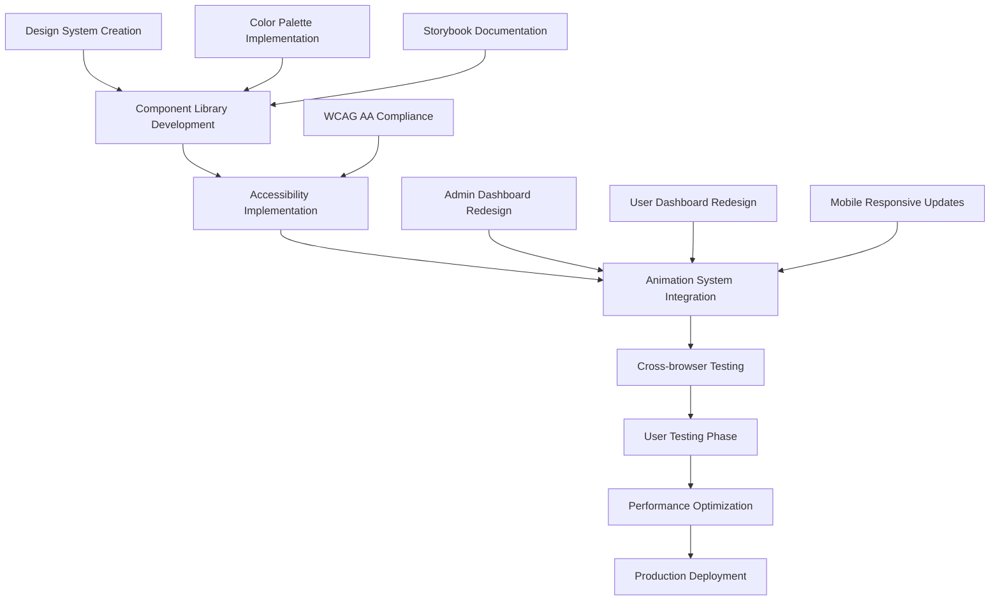

## 1. Product Overview
A comprehensive UI/UX redesign initiative to transform the existing dual-dashboard system into a modern, accessible, and visually cohesive platform. This redesign implements a unified design system with carefully curated color palette, smooth animations, and enhanced user experience across all interfaces.

**Problems Solved:**
- Inconsistent visual identity across admin and user dashboards
- Lack of accessibility compliance (WCAG AA) in current design
- Missing animation system for improved user engagement
- Need for comprehensive design system documentation
- Requirement for component library with Storybook integration

**Target Users:**
- System administrators requiring professional, data-focused interface
- Regular users needing intuitive, accessible dashboard experience
- Development team requiring reusable component library

## 2. Core Features

### 2.1 User Roles
| Role | Registration Method | Core Permissions |
|------|---------------------|------------------|
| System Administrator | Admin-only registration | Full system access, design system management, analytics configuration |
| Regular User | Standard email registration | Personal dashboard access, theme preference settings, accessibility options |
| Design System Admin | Technical role assignment | Component library management, design token updates, Storybook administration |

### 2.2 Feature Module
Our UI/UX redesign consists of the following enhanced interfaces:
1. **Enhanced Admin Dashboard**: redesigned with new color palette, improved data visualization, smooth animations
2. **Enhanced User Dashboard**: accessible design with cream accents, intuitive navigation, responsive layouts
3. **Design System Portal**: comprehensive component library, documentation, and Storybook integration
4. **Animation System**: purposeful transitions, micro-interactions, loading states
5. **Accessibility Center**: WCAG AA compliance tools, color contrast validation, screen reader optimization

### 2.3 Page Details
| Page Name | Module Name | Feature description |
|-----------|-------------|---------------------|
| Enhanced Admin Dashboard | Analytics Visualization | Display system metrics using new color palette (#162660 primary, #D0E6FD secondary) with smooth chart animations and real-time data updates |
| Enhanced Admin Dashboard | User Management Interface | Implement accessible data tables with proper color contrast, keyboard navigation, and screen reader support for WCAG AA compliance |
| Enhanced User Dashboard | Personal Overview | Redesign with cream accent color (#F1E4D1), improved card layouts, and smooth entrance animations for better user engagement |
| Enhanced User Dashboard | Profile Settings | Accessible form design with proper focus states, error validation, and color contrast ratios meeting WCAG AA standards |
| Design System Portal | Component Library | Comprehensive UI component collection with new color scheme, documented in Storybook with usage examples and accessibility guidelines |
| Design System Portal | Color Guidelines | Detailed color usage documentation including primary (#162660), secondary (#D0E6FD), accent (#F1E4D1) with contrast ratios and accessibility notes |
| Design System Portal | Animation Guidelines | Motion system documentation with duration (200-500ms), easing functions, and performance optimization for 60fps target |
| Animation System | Page Transitions | Smooth route transitions between admin and user dashboards with consistent timing and easing across the platform |
| Animation System | Micro-interactions | Hover states, click feedback, loading animations, and interactive element responses using defined animation principles |
| Accessibility Center | WCAG Compliance Tools | Built-in color contrast checker, keyboard navigation testing, and screen reader compatibility verification |

## 3. Core Process

### Design Implementation Flow
1. Design team creates component library in Storybook with new color palette
2. Development team implements base components with accessibility features
3. QA team performs cross-browser testing and accessibility validation
4. User testing conducted with 5+ participants for usability validation
5. Performance testing ensures 60fps animation targets are met
6. Gradual rollout starting with admin dashboard, then user dashboard

### Color Implementation Process
1. Update global CSS variables with new color tokens
2. Implement color contrast validation tools
3. Test WCAG AA compliance across all components
4. Create responsive color adaptations for different screen sizes
5. Document color usage guidelines and accessibility requirements

### Animation Implementation Process
1. Define animation tokens (duration, easing, motion principles)
2. Implement base animation utilities and hooks
3. Create purposeful animations for page transitions and interactions
4. Optimize for performance with hardware acceleration
5. Test across devices and browsers for consistency

## 4. User Interface Design

### 4.1 Design Style
**Unified Color System:**
- Primary Color: #162660 (Dark blue) - Main backgrounds, primary buttons, headers
- Secondary Color: #D0E6FD (Light blue) - Secondary actions, hover states, borders
- Accent Color: #F1E4D1 (Cream) - Highlights, notifications, success states
- Neutral Colors: #FFFFFF (White), #F8F9FA (Light gray), #6C757D (Gray), #212529 (Dark)
- Status Colors: #28A745 (Success), #DC3545 (Error), #FFC107 (Warning), #17A2B8 (Info)

**Typography System:**
- Primary Font: Inter (Headers and body text)
- Font Sizes: 12px (small), 14px (body), 16px (base), 20px (h4), 24px (h3), 32px (h2), 48px (h1)
- Line Heights: 1.2 (headers), 1.5 (body), 1.6 (long text)
- Font Weights: 400 (regular), 500 (medium), 600 (semibold), 700 (bold)

**Button Styles:**
- Primary: #162660 background, white text, 8px border radius, hover with 10% darken
- Secondary: #D0E6FD background, #162660 text, 8px border radius, hover with 5% darken
- Accent: #F1E4D1 background, #162660 text, 8px border radius, hover with 5% darken
- Animation: 200ms ease-in-out for all state transitions

**Animation Guidelines:**
- Duration: 200ms (micro-interactions), 300ms (component transitions), 500ms (page transitions)
- Easing: ease-in-out for most animations, ease-out for entrances, ease-in for exits
- Performance: Hardware acceleration, will-change property optimization
- Accessibility: Respect prefers-reduced-motion preference

**Layout System:**
- Grid: 12-column responsive grid with 24px gutters
- Spacing: 4px base unit (4, 8, 12, 16, 24, 32, 48, 64px scale)
- Container: Max-width 1200px with 16px padding on mobile, 24px on tablet, 32px on desktop
- Card Design: Rounded corners (12px), subtle shadows, consistent padding

### 4.2 Page Design Overview
| Page Name | Module Name | UI Elements |
|-----------|-------------|-------------|
| Enhanced Admin Dashboard | Analytics Cards | Dark blue (#162660) header cards with cream (#F1E4D1) accent borders, smooth number count-up animations, Chart.js integration with new color palette |
| Enhanced Admin Dashboard | Data Tables | Accessible table design with proper color contrast, keyboard navigation support, hover states using light blue (#D0E6FD), loading skeleton animations |
| Enhanced User Dashboard | Welcome Section | Cream accent background (#F1E4D1) with dark blue text (#162660), smooth fade-in animation, personalized greeting with user name |
| Enhanced User Dashboard | Quick Actions | Rounded button design with 8px border radius, hover animations (200ms), focus states with 2px outline offset |
| Design System Portal | Component Showcase | Interactive component gallery with live code examples, color contrast validation, responsive behavior demonstration |
| Design System Portal | Animation Library | Motion examples with timing controls, easing function demonstrations, performance metrics display |

### 4.3 Responsiveness and Accessibility
**Responsive Design:**
- Mobile-first approach with breakpoints at 480px, 768px, 1024px, 1200px
- Touch-optimized interactions with minimum 44px touch targets
- Responsive typography scaling with viewport units
- Flexible grid system that adapts to screen size

**Accessibility Features:**
- WCAG AA color contrast compliance (minimum 4.5:1 for normal text, 3:1 for large text)
- Keyboard navigation support for all interactive elements
- Screen reader optimization with proper ARIA labels
- Focus management with visible focus indicators
- Reduced motion support for users with vestibular disorders

**Performance Optimization:**
- 60fps animation target with hardware acceleration
- Optimized asset loading with lazy loading for images
- Critical CSS inlining for faster initial render
- Component code splitting for reduced bundle size