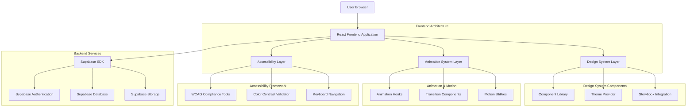

## 1. Architecture Design



## 2. Technology Description

**Frontend Stack:**
- Frontend: React@18 + tailwindcss@3 + vite
- Initialization Tool: vite-init
- Design System: Storybook@7 + styled-components@6
- Animation Library: framer-motion@10 + react-spring@9
- Accessibility: @react-aria/@react-stately + jest-axe
- Testing: @storybook/testing-react + @testing-library/react
- Performance: react-window + react-intersection-observer

**Color Management:**
- CSS Custom Properties for dynamic theming
- Color contrast validation using wcag-contrast
- Dark/light mode support with prefers-color-scheme
- High contrast mode detection and adaptation

**Animation Framework:**
- Framer Motion for complex animations and gestures
- React Spring for physics-based animations
- CSS transitions for simple state changes
- Web Animations API for performance-critical animations

## 3. Route Definitions

| Route | Purpose | Design System Features |
|-------|---------|----------------------|
| / | Landing page with role selection | Smooth page transitions, hero animations, accessibility-first design |
| /login/admin | Admin login page | Dark theme, high contrast, keyboard navigation, focus management |
| /login/user | User login page | Light theme with cream accents, smooth form animations |
| /register | User registration page | Accessible form validation, error states with new color palette |
| /admin/dashboard | Enhanced admin dashboard | Analytics cards with animations, data visualization with new colors |
| /admin/users | User management page | Accessible data tables, loading states, smooth transitions |
| /admin/analytics | System analytics page | Chart.js integration with color scheme, real-time updates |
| /admin/settings | System configuration page | Form components with validation, theme customization |
| /user/dashboard | Enhanced user dashboard | Personal overview with cream accents, card animations |
| /user/profile | User profile management | Accessible form design, image upload with preview |
| /user/analytics | Personal analytics page | Responsive charts, smooth data loading |
| /design-system | Design system portal | Component showcase, documentation, live examples |
| /design-system/components | Component library | Interactive component gallery with code examples |
| /design-system/animations | Animation guidelines | Motion examples, timing controls, best practices |
| /design-system/accessibility | Accessibility guidelines | WCAG compliance tools, testing utilities |
| /storybook | Storybook documentation | Component development environment |

## 4. Design System Architecture

### 4.1 Component Library Structure
```
src/
├── components/
│   ├── atoms/
│   │   ├── Button/
│   │   │   ├── Button.jsx
│   │   │   ├── Button.module.css
│   │   │   ├── Button.stories.jsx
│   │   │   └── Button.test.jsx
│   │   ├── Input/
│   │   ├── Card/
│   │   └── Badge/
│   ├── molecules/
│   │   ├── FormField/
│   │   ├── DataTable/
│   │   ├── SearchBar/
│   │   └── Navigation/
│   ├── organisms/
│   │   ├── Header/
│   │   ├── Sidebar/
│   │   ├── DashboardCard/
│   │   └── AnalyticsChart/
│   └── templates/
│       ├── AdminLayout/
│       ├── UserLayout/
│       └── AuthLayout/
├── styles/
│   ├── design-tokens/
│   │   ├── colors.js
│   │   ├── typography.js
│   │   ├── spacing.js
│   │   ├── animations.js
│   │   └── breakpoints.js
│   ├── themes/
│   │   ├── adminTheme.js
│   │   ├── userTheme.js
│   │   └── globalTheme.js
│   └── utils/
│       ├── colorContrast.js
│       ├── animationHelpers.js
│       └── accessibility.js
```

### 4.2 Color System Implementation
```javascript
// design-tokens/colors.js
export const colors = {
  primary: {
    50: '#f0f4ff',
    100: '#e5edff',
    500: '#162660',
    600: '#141b54',
    700: '#121648',
    900: '#0e0c30',
  },
  secondary: {
    50: '#f8fbff',
    100: '#f0f7fe',
    500: '#d0e6fd',
    600: '#b8d4fc',
    700: '#a0c2fb',
    900: '#709ef9',
  },
  accent: {
    50: '#fefcf8',
    100: '#fdf8f0',
    500: '#f1e4d1',
    600: '#ebd8bc',
    700: '#e5cca7',
    900: '#d9b479',
  },
  neutral: {
    white: '#ffffff',
    gray100: '#f8f9fa',
    gray300: '#dee2e6',
    gray500: '#6c757d',
    gray700: '#495057',
    gray900: '#212529',
    black: '#000000',
  },
  status: {
    success: '#28a745',
    error: '#dc3545',
    warning: '#ffc107',
    info: '#17a2b8',
  },
  wcag: {
    getContrastRatio: (color1, color2) => {
      // Implementation for WCAG contrast ratio calculation
    },
    meetsAA: (color1, color2, fontSize = 16) => {
      // Check if colors meet WCAG AA standards
    },
    meetsAAA: (color1, color2, fontSize = 16) => {
      // Check if colors meet WCAG AAA standards
    },
  },
};
```

### 4.3 Animation System
```javascript
// design-tokens/animations.js
export const animations = {
  duration: {
    instant: 100,
    fast: 200,
    normal: 300,
    slow: 500,
    slower: 700,
  },
  easing: {
    standard: 'cubic-bezier(0.4, 0, 0.2, 1)',
    deceleration: 'cubic-bezier(0, 0, 0.2, 1)',
    acceleration: 'cubic-bezier(0.4, 0, 1, 1)',
    sharp: 'cubic-bezier(0.4, 0, 0.6, 1)',
  },
  transitions: {
    fadeIn: {
      initial: { opacity: 0 },
      animate: { opacity: 1 },
      exit: { opacity: 0 },
      transition: { duration: 0.3, ease: 'standard' },
    },
    slideIn: {
      initial: { x: -20, opacity: 0 },
      animate: { x: 0, opacity: 1 },
      exit: { x: 20, opacity: 0 },
      transition: { duration: 0.3, ease: 'deceleration' },
    },
    scaleIn: {
      initial: { scale: 0.9, opacity: 0 },
      animate: { scale: 1, opacity: 1 },
      exit: { scale: 0.9, opacity: 0 },
      transition: { duration: 0.2, ease: 'deceleration' },
    },
  },
  performance: {
    willChange: 'transform, opacity',
    transformGPU: true,
    reducedMotion: '@media (prefers-reduced-motion: reduce)',
  },
};
```

## 5. API Definitions

### 5.1 Design System APIs

**Get Component Configuration**
```
GET /api/design-system/components/:componentName
```

Response:
```json
{
  "name": "Button",
  "props": {
    "variant": {
      "type": "enum",
      "values": ["primary", "secondary", "accent"],
      "default": "primary"
    },
    "size": {
      "type": "enum", 
      "values": ["small", "medium", "large"],
      "default": "medium"
    },
    "disabled": {
      "type": "boolean",
      "default": false
    }
  },
  "accessibility": {
    "ariaLabel": "string",
    "role": "button",
    "tabIndex": 0
  },
  "animations": {
    "hover": "scaleIn",
    "focus": "fadeIn",
    "duration": 200
  }
}
```

**Validate Color Contrast**
```
POST /api/design-system/validate-contrast
```

Request:
```json
{
  "foreground": "#162660",
  "background": "#ffffff",
  "fontSize": 16,
  "fontWeight": 400
}
```

Response:
```json
{
  "contrastRatio": 12.5,
  "meetsAA": true,
  "meetsAAA": true,
  "recommendation": "Excellent contrast ratio",
  "wcagLevel": "AAA"
}
```

### 5.2 Theme Management APIs

**Get User Theme Preferences**
```
GET /api/user/theme-preferences
```

Response:
```json
{
  "theme": "light",
  "colorBlindMode": false,
  "highContrast": false,
  "reducedMotion": false,
  "fontSize": "medium",
  "customColors": {
    "primary": "#162660",
    "secondary": "#d0e6fd",
    "accent": "#f1e4d1"
  }
}
```

**Update Theme Preferences**
```
PUT /api/user/theme-preferences
```

Request:
```json
{
  "theme": "dark",
  "reducedMotion": true,
  "fontSize": "large"
}
```

## 6. Component Architecture

### 6.1 Base Component Structure
```javascript
// components/atoms/Button/Button.jsx
import React from 'react';
import { motion } from 'framer-motion';
import { useTheme } from '../../../styles/themes';
import { animations } from '../../../styles/design-tokens/animations';
import { validateAccessibility } from '../../../styles/utils/accessibility';
import styles from './Button.module.css';

const Button = ({ 
  children, 
  variant = 'primary', 
  size = 'medium', 
  disabled = false,
  onClick,
  ariaLabel,
  ...props 
}) => {
  const theme = useTheme();
  
  // Accessibility validation
  const accessibilityProps = validateAccessibility({
    'aria-label': ariaLabel || children,
    'aria-disabled': disabled,
    role: 'button',
    tabIndex: disabled ? -1 : 0,
  });

  const buttonVariants = {
    primary: {
      backgroundColor: theme.colors.primary[500],
      color: theme.colors.neutral.white,
      border: `2px solid ${theme.colors.primary[500]}`,
    },
    secondary: {
      backgroundColor: theme.colors.secondary[500],
      color: theme.colors.primary[500],
      border: `2px solid ${theme.colors.secondary[500]}`,
    },
    accent: {
      backgroundColor: theme.colors.accent[500],
      color: theme.colors.primary[500],
      border: `2px solid ${theme.colors.accent[500]}`,
    },
  };

  return (
    <motion.button
      className={`${styles.button} ${styles[size]}`}
      style={buttonVariants[variant]}
      whileHover={!disabled ? { scale: 1.05 } : {}}
      whileTap={!disabled ? { scale: 0.95 } : {}}
      transition={animations.transitions.scaleIn.transition}
      onClick={!disabled ? onClick : undefined}
      disabled={disabled}
      {...accessibilityProps}
      {...props}
    >
      {children}
    </motion.button>
  );
};

export default Button;
```

### 6.2 Animation Hook Implementation
```javascript
// hooks/useAnimation.js
import { useReducedMotion } from 'framer-motion';
import { useEffect, useState } from 'react';

export const useAnimation = (animationType, options = {}) => {
  const shouldReduceMotion = useReducedMotion();
  const [animation, setAnimation] = useState(null);

  useEffect(() => {
    if (shouldReduceMotion && !options.forceAnimation) {
      setAnimation({
        initial: {},
        animate: {},
        transition: { duration: 0 },
      });
      return;
    }

    const baseAnimation = getAnimationConfig(animationType);
    setAnimation({
      ...baseAnimation,
      transition: {
        ...baseAnimation.transition,
        ...options,
      },
    });
  }, [animationType, shouldReduceMotion, options]);

  return animation;
};

const getAnimationConfig = (type) => {
  const configs = {
    fadeIn: {
      initial: { opacity: 0 },
      animate: { opacity: 1 },
      exit: { opacity: 0 },
    },
    slideIn: {
      initial: { x: -20, opacity: 0 },
      animate: { x: 0, opacity: 1 },
      exit: { x: 20, opacity: 0 },
    },
    scaleIn: {
      initial: { scale: 0.9, opacity: 0 },
      animate: { scale: 1, opacity: 1 },
      exit: { scale: 0.9, opacity: 0 },
    },
  };

  return configs[type] || configs.fadeIn;
};
```

## 7. Testing Strategy

### 7.1 Visual Regression Testing
```javascript
// tests/visual-regression/button.test.js
import { test, expect } from '@playwright/test';

test.describe('Button Component Visual Regression', () => {
  test('primary button appearance', async ({ page }) => {
    await page.goto('/storybook/iframe.html?id=components-button--primary');
    await page.waitForLoadState('networkidle');
    
    const button = await page.locator('[data-testid="button-primary"]');
    await expect(button).toHaveScreenshot('button-primary.png');
  });

  test('button hover state', async ({ page }) => {
    await page.goto('/storybook/iframe.html?id=components-button--primary');
    const button = await page.locator('[data-testid="button-primary"]');
    
    await button.hover();
    await page.waitForTimeout(300); // Wait for animation
    
    await expect(button).toHaveScreenshot('button-primary-hover.png');
  });
});
```

### 7.2 Accessibility Testing
```javascript
// tests/accessibility/button.test.js
import { render, axe } from '@testing-library/react';
import { axe, toHaveNoViolations } from 'jest-axe';
import Button from '../../../components/atoms/Button';

expect.extend(toHaveNoViolations);

test('Button meets WCAG AA standards', async () => {
  const { container } = render(
    <Button variant="primary" ariaLabel="Test button">
      Test Button
    </Button>
  );

  const results = await axe(container);
  expect(results).toHaveNoViolations();
});

test('Button has proper color contrast', () => {
  const { getByRole } = render(
    <Button variant="primary">Test Button</Button>
  );
  
  const button = getByRole('button');
  const styles = window.getComputedStyle(button);
  
  const contrastRatio = getContrastRatio(
    styles.backgroundColor,
    styles.color
  );
  
  expect(contrastRatio).toBeGreaterThanOrEqual(4.5); // WCAG AA for normal text
});
```

## 8. Performance Optimization

### 8.1 Animation Performance
```javascript
// utils/animationPerformance.js
export const optimizeAnimation = (element) => {
  // Force hardware acceleration
  element.style.willChange = 'transform, opacity';
  element.style.transform = 'translateZ(0)';
  
  // Use requestAnimationFrame for smooth animations
  let frameId;
  const animate = () => {
    // Animation logic here
    frameId = requestAnimationFrame(animate);
  };
  
  const stop = () => {
    cancelAnimationFrame(frameId);
    element.style.willChange = 'auto';
  };
  
  return { start: animate, stop };
};

export const measureFPS = (callback) => {
  let lastTime = performance.now();
  let frames = 0;
  
  const measure = (currentTime) => {
    frames++;
    
    if (currentTime >= lastTime + 1000) {
      const fps = Math.round((frames * 1000) / (currentTime - lastTime));
      callback(fps);
      frames = 0;
      lastTime = currentTime;
    }
    
    requestAnimationFrame(measure);
  };
  
  requestAnimationFrame(measure);
};
```

### 8.2 Component Lazy Loading
```javascript
// App.jsx
import { lazy, Suspense } from 'react';
import { Spinner } from './components/atoms/Spinner';

// Lazy load heavy components
const AdminDashboard = lazy(() => import('./pages/admin/Dashboard'));
const UserDashboard = lazy(() => import('./pages/user/Dashboard'));
const DesignSystem = lazy(() => import('./pages/design-system/Index'));

function App() {
  return (
    <Suspense fallback={<Spinner />}>
      <Routes>
        <Route path="/admin/dashboard" element={<AdminDashboard />} />
        <Route path="/user/dashboard" element={<UserDashboard />} />
        <Route path="/design-system/*" element={<DesignSystem />} />
      </Routes>
    </Suspense>
  );
}
```

## 9. Deployment Configuration

### 9.1 Build Optimization
```javascript
// vite.config.js
import { defineConfig } from 'vite';
import react from '@vitejs/plugin-react';
import { visualizer } from 'rollup-plugin-visualizer';

export default defineConfig({
  plugins: [
    react(),
    visualizer({
      filename: './dist/stats.html',
      open: true,
      gzipSize: true,
      brotliSize: true,
    }),
  ],
  build: {
    target: 'es2015',
    minify: 'terser',
    terserOptions: {
      compress: {
        drop_console: true,
        drop_debugger: true,
      },
    },
    rollupOptions: {
      output: {
        manualChunks: {
          'react-vendor': ['react', 'react-dom'],
          'animation-vendor': ['framer-motion', 'react-spring'],
          'ui-vendor': ['@headlessui/react', '@heroicons/react'],
          'utils': ['lodash', 'date-fns'],
        },
      },
    },
    chunkSizeWarningLimit: 1000,
  },
  css: {
    preprocessorOptions: {
      scss: {
        additionalData: `@import "src/styles/design-tokens/index.scss";`,
      },
    },
  },
});
```

### 9.2 Storybook Configuration
```javascript
// .storybook/main.js
module.exports = {
  stories: ['../src/**/*.stories.@(js|jsx|ts|tsx|mdx)'],
  addons: [
    '@storybook/addon-essentials',
    '@storybook/addon-a11y',
    '@storybook/addon-interactions',
    '@storybook/addon-measure',
    '@storybook/addon-outline',
  ],
  framework: '@storybook/react-vite',
  features: {
    buildStoriesJson: true,
    storyStoreV7: true,
  },
  viteFinal: async (config) => {
    return {
      ...config,
      define: {
        ...config.define,
        global: 'window',
      },
    };
  },
};
```